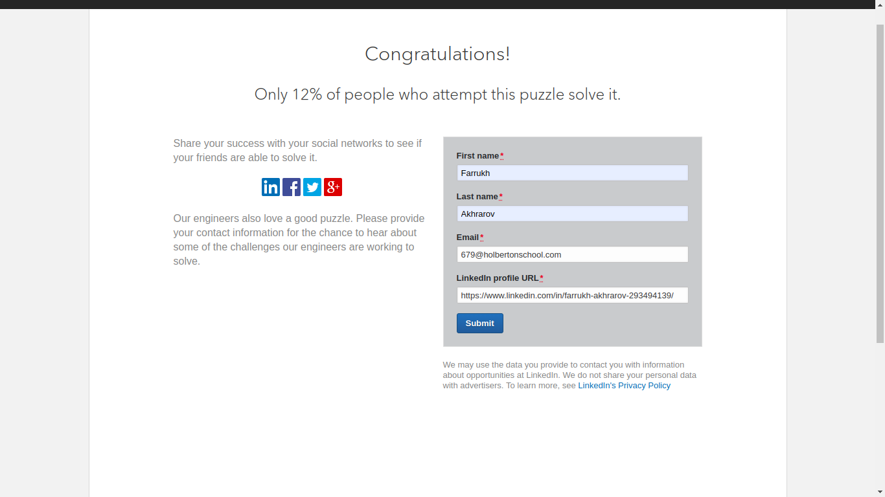

# 0x06. Regular expression

## Description
What you should learn from this project:
* How to use regular expressions
---

### [0. Simply matching Holberton](./0-simply_match_holberton.rb)


### [1. Repetition Token #0](./1-repetition_token_0.rb)


### [2. Repetition Token #1](./2-repetition_token_1.rb)


### [3. Repetition Token #2](./3-repetition_token_2.rb)


### [4. Repetition Token #3](./4-repetition_token_3.rb)


### [5. Not quite HBTN yet](./5-beginning_and_end.rb)
Requirements:

* The regular expression must be exactly matching a string that starts with h ends with n and can have any single character in between
* Using the project instructions, create a Ruby script that accepts one argument and pass it to a regular expression matching method

Example:
```
sylvain@ubuntu$ ./5-beginning_and_end.rb 'hn' | cat -e
$
sylvain@ubuntu$ ./5-beginning_and_end.rb 'hbn' | cat -e
hbn$
sylvain@ubuntu$ ./5-beginning_and_end.rb 'hbtn' | cat -e
$
sylvain@ubuntu$ ./5-beginning_and_end.rbb 'h8n' | cat -e
h8n$
sylvain@ubuntu$
$
```
### [6. Call me maybe](./6-phone_number.rb)
This task is brought to you by Holberton mentor Neha Jain, Senior Software Engineer at LinkedIn.

Requirement:

* The regular expression must match a 10 digit phone number

Example:
```
sylvain@ubuntu$ ./6-phone_number.rb 4155049898 | cat -e
4155049898$
sylvain@ubuntu$ ./6-phone_number.rb " 4155049898" | cat -e
$
sylvain@ubuntu$ ./6-phone_number.rb "415 504 9898" | cat -e
$
sylvain@ubuntu$ ./6-phone_number.rb "415-504-9898" | cat -e
$
sylvain@ubuntu$
```

### [7. OMG WHY ARE YOU SHOUTING?](./7-OMG_WHY_ARE_YOU_SHOUTING.rb)
Requirement:

* The regular expression must be only matching: capital letters

Example:

```
sylvain@ubuntu$ ./7-OMG_WHY_ARE_YOU_SHOUTING.rb "I realLy hOpe VancouvEr posseSs Yummy Soft vAnilla Dupper Mint Ice Nutella cream" | cat -e
ILOVESYSADMIN$
sylvain@ubuntu$ ./7-OMG_WHY_ARE_YOU_SHOUTING.rb "WHAT do you SAY?" | cat -e
WHATSAY$
sylvain@ubuntu$ ./7-OMG_WHY_ARE_YOU_SHOUTING.rb "cannot read you" | cat -e
$
sylvain@ubuntu$
```

### [8. Textme](./100-textme.rb)
This exercise was prepared for you by Guillaume Plessis, VP of Infrastructure at TextMe. It is something he uses daily. You can thank Guillaume for his project on Twitter.

For this task, you’ll be taking over Guillaume’s responsibilities: one afternoon, a TextMe VoIP Engineer comes to you and explains she wants to run some statistics on the TextMe app text messages transactions.

Requirements:

* Your script should output: `[SENDER]`,`[RECEIVER]`,`[FLAGS]`
* The sender phone number or name (including country code if present)
* The receiver phone number or name (including country code if present)
* The flags that were used
* You can find a log file here.

Example:


### [9. Pass LinkedIn technical interview level0](./101-passed_linkedin_regex_challenge.jpg)
* One way to get started in getting a Software Engineering job at LinkedIn is to solve their regex puzzle.


---

## Author
* **Farrukh Akhrarov** - [narnat](https://github.com/narnat)
